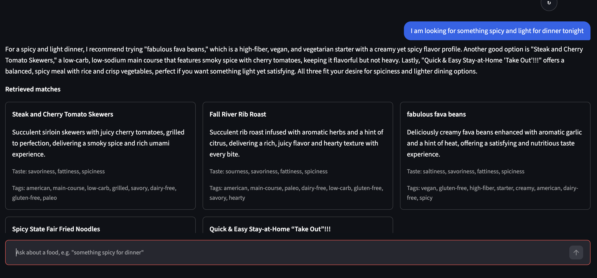
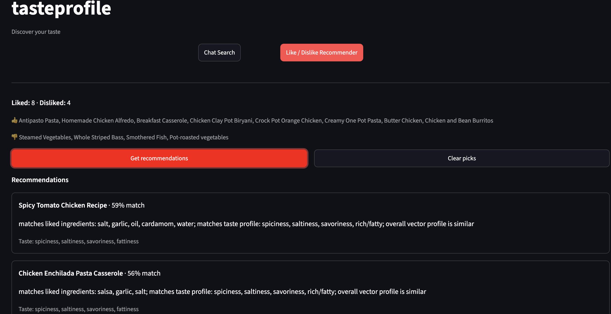

# tasteprofile

A food-recommendation RAG (Retrieval-Augmented Generation) system, built end-to-end: data enrichment → vector database → LLM-driven conversational search → evaluation → a Streamlit UI.

Two ways to interact with it, both served from `app.py`:

- **Chat Search** — a multi-turn conversational interface. An LLM parses free-text queries into structured filters + a semantic query, retrieves candidates from a Chroma vector store, and generates an answer grounded strictly in the retrieved foods.
- **Like / Dislike Recommender** — pick foods you like/dislike and get re-ranked recommendations from a taste-profile scorer (vector similarity + ingredient/taste/cuisine overlap), no LLM involved.

## Screenshots

**Chat Search** — conversational, retrieval-grounded answers, with the retrieved matches shown alongside the response:



**Like / Dislike Recommender** — pick liked/disliked foods, get re-ranked recommendations with a match percentage and the reasoning behind it:



## Setup

```bash
python3 -m venv .venv
source .venv/bin/activate
pip install -r requirements.txt

cp .env.example .env
# edit .env and set OPENAI_API_KEY

streamlit run app.py
```

This works immediately against the vector database already checked into the repo (`chroma_food_db_clean/`) — no need to re-run the data pipeline just to try the app.

## Project structure

```
tasteprofile/
├── app.py                  # Streamlit UI — the app entry point
├── config.py                # shared paths/constants, loads .env
├── parsedsearch.py           # chat search engine (imported by app.py)
├── reccomendation.py         # like/dislike recommender (imported by app.py)
├── chroma_food_db_clean/     # the vector database
├── data/                     # only datafood.csv is committed; other stages are regenerable (see below)
├── pipeline/                 # offline data-prep scripts (run in order, see below)
├── eval/                     # eval scripts, hand-authored test cases, generated results
├── docs/screenshots/         # README images
└── requirements.txt, .env.example, .streamlit/config.toml, ...
```

`app.py`, `config.py`, `parsedsearch.py`, and `reccomendation.py` stay together at the repo root since they're tightly coupled (imported directly into each other) and are what `streamlit run app.py` actually needs. Everything else — the one-time data pipeline and the evaluation harness — is grouped into its own folder. All commands in this README assume you're running them from the repo root.

## Architecture

**Data pipeline** (offline, run once to (re)build the dataset — scripts live in `pipeline/`, data in `data/`):

```
data/recipes-with-nutrition.csv
    → pipeline/enrichment.py   (LLM-enriches each recipe: short_description, tags, taste labels)
    → data/recipes_enriched_partial.csv / data/test.csv
    → [manual step]             (adds an `embedding_text` column; no script for this yet)
    → data/foodfacts.csv
    → pipeline/numeric.py       (adds a stable food_id per row)
    → data/foodsfactsfinal.csv
    → pipeline/refining2.py     (regex-based conflict cleanup, e.g. "chicken" mislabeled "Vegan")
    → data/cleanfood.csv + data/label_cleanup_audit.csv
    → pipeline/refine.py        (rebuilds embedding_text)
    → data/datafood.csv
    → pipeline/vectors.py       (embeds + upserts into Chroma)
    → chroma_food_db_clean/     (collection: foods_cleaned)
```

**Only `data/datafood.csv` (the final pipeline output) and `chroma_food_db_clean/` are committed to the repo.** `recipes-with-nutrition.csv` and the four intermediate stages (`recipes_enriched_partial.csv`, `test.csv`, `foodfacts.csv`, `foodsfactsfinal.csv`) are left out of git — each is just a snapshot of the same dataset partway through cleaning, fully reproducible by re-running the pipeline above, so keeping all of them committed would just be redundant weight in the repo. If you want to regenerate from scratch, you'll need the raw `recipes-with-nutrition.csv` recipe dataset yourself (an Edamam-style recipes-with-nutrition dataset) placed at that path — this repo doesn't redistribute it.

The `test.csv → foodfacts.csv` step was done ad hoc during development (it adds the `embedding_text` column) — there's no script for it yet, noted here so the pipeline isn't a mystery gap.

**Runtime** (what the app actually calls):

- `parsedsearch.py` — the chat search engine. Entry point: `run_search_turn(user_query, chat_history, app_state)`. Internally: LLM query parsing (`gpt-4.1-mini`) → Chroma metadata filter + vector search → adaptive relaxation on weak matches → grounded LLM answer generation.
- `reccomendation.py` — the like/dislike recommender. Entry point: `recommend_foods(liked_food_ids, disliked_food_ids, num_recommendations)`. Pure retrieval + weighted re-ranking, no LLM calls.
- `config.py` — centralizes `CHROMA_PATH`, `COLLECTION_NAME`, and CSV paths, and loads `.env`.
- `app.py` — the Streamlit UI wrapping both of the above.

**Re-running the pipeline** is optional — only needed if you want to regenerate the dataset/vector DB from scratch: `python pipeline/enrichment.py`, then the remaining `pipeline/` scripts in order, then `python pipeline/vectors.py`, all run from the repo root. For just running/demoing the app, skip straight to `streamlit run app.py`.

## Evaluation

`eval/run_ragas_food_eval.py` replays 50 hand-authored test cases (`eval/food_eval_cases_references_updated.json`) against `parsedsearch.py`'s pipeline and scores it two ways:

- **Rule-based checks** — did parsing hit the expected filters, does retrieval carry the expected metadata, are banned/required terms present or absent, is the top match's vector distance within a sane threshold.
- **RAGAS (LLM-as-judge) metrics** — Faithfulness (is the answer grounded in retrieved context), Answer Relevancy, and Context Precision, judged by `gpt-4o-mini`.

Run it with `python eval/run_ragas_food_eval.py`; results land in `eval/food_eval_summary.json` (and per-case detail in `eval/food_eval_rule_results.csv` / `eval/food_eval_ragas_results.csv`).

`eval/run_deepeval_food_eval.py` then scores the *same* generated answers through [DeepEval](https://github.com/confident-ai/deepeval), a second, independently-built LLM-eval framework — a useful cross-check that the RAGAS numbers aren't an artifact of one framework's particular judging approach. It reuses `eval/food_eval_ragas_input.json` (the exact question/answer/retrieved-context rows RAGAS scored) rather than re-running the pipeline, so run `run_ragas_food_eval.py` first. Metrics: Answer Relevancy, Faithfulness, Contextual Precision, Contextual Recall, also judged by `gpt-4o-mini`. Results land in `eval/food_eval_deepeval_summary.json`.

**Latest results:**

| Metric | Score |
|---|---|
| Rule-based pass rate (50 cases) | 41/50 (82%) |
| RAGAS Faithfulness | 0.825 |
| RAGAS Answer Relevancy | 0.793 |
| RAGAS Context Precision | 0.988 |
| DeepEval Answer Relevancy | 0.886 |
| DeepEval Faithfulness | 0.758 |
| DeepEval Contextual Precision | 0.912 |
| DeepEval Contextual Recall | 0.762 |

(RAGAS/DeepEval scores are computed over the 36 cases that reach the recommend/answer path, not the full 50 — cases where the assistant asks a clarifying follow-up instead of answering are excluded from both, since there's no generated answer to grade.)

Full per-case detail in `eval/food_eval_rule_results.csv` / `eval/food_eval_ragas_results.csv`; raw summaries in `eval/food_eval_summary.json` and `eval/food_eval_deepeval_summary.json`.

Most rule-check failures were cases where the expected behavior was `recommend` but the assistant asked a follow-up question instead (a reasonable judgment call on genuinely under-specified queries, e.g. "What is a really easy meal I can make in under 15 minutes?") — not outright wrong answers.

The two frameworks broadly agree (both put faithfulness in the mid-0.7s to low-0.8s range and context precision above 0.9), which is a reasonable independent sanity check on the pipeline's grounding — though faithfulness in particular (mid-0.7s to low-0.8s on both) is the metric most worth improving next, since it reflects how well the generated answer sticks to only the retrieved foods. One honest caveat: both frameworks' metrics are themselves LLM-judged, so they're a useful directional signal, not ground truth. The rule-based checks are heuristic pattern matches, not full semantic validation.
